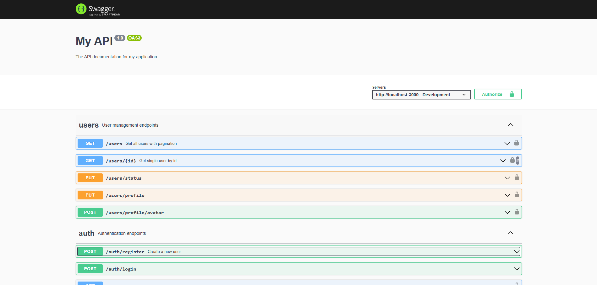

<p align="center">
  
</p>

# Chat Application Backend

A real-time chat application backend built with NestJS, TypeORM, PostgreSQL, and Socket.IO.

## Features

- User authentication with JWT
- Role-based access control
- Real-time messaging with Socket.IO
- PostgreSQL database with TypeORM
- API documentation with Swagger
- Docker support for easy deployment

## API Endpoints

Please refer to [END_POINT.md](END_POINT.md) for the complete list of REST endpoints and WebSocket events.

## Project Setup

### Prerequisites

- Node.js (v18+)
- PostgreSQL
- npm

### Installation

```bash
$ npm install
```

### Environment Configuration

Copy the example environment file and update it with your settings:

```bash
$ cp .env.example .env
```

### Database Migrations

```bash
# generate a migration
$ npm run migration:generate

# run migrations
$ npm run migration:run

# revert migrations
$ npm run migration:revert

# show migration status
$ npm run migration:show
```

## Running the Application

```bash
# development
$ npm run start

# watch mode
$ npm run start:dev

# production mode
$ npm run start:prod
```

## Testing

```bash
# unit tests
$ npm run test

# e2e tests
$ npm run test:e2e

# test coverage
$ npm run test:cov
```

## Docker Deployment

This project includes Docker configuration for easy deployment:

```bash
# build and start containers
$ docker-compose up -d

# stop containers
$ docker-compose down
```

## API Documentation

Once the application is running, you can access the Swagger API documentation at:

```
http://localhost:3000/api-docs
```

### Swagger UI Preview



The interactive API documentation provides:
- Complete endpoint documentation
- Request/response schemas
- Authentication examples
- Try-it-out functionality for testing endpoints

## WebSocket Events

The application supports real-time communication through WebSocket events. See [END_POINT.md](END_POINT.md) for details on available events.

## Project Structure

```
src/
├── auth/           # Authentication module
├── users/          # User management module
├── config/         # Configuration files
├── migrations/     # Database migrations
└── main.ts         # Application entry point

docs/
└── images/         # Documentation images and screenshots

public/
└── uploads/        # User uploaded files (profile pictures, attachments)
    ├── profile-pictures/
    ├── attachments/
    └── thumbnails/
```

## License

This project is [MIT licensed](LICENSE).
